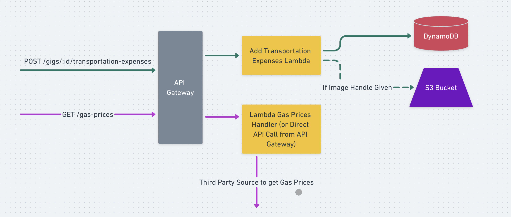
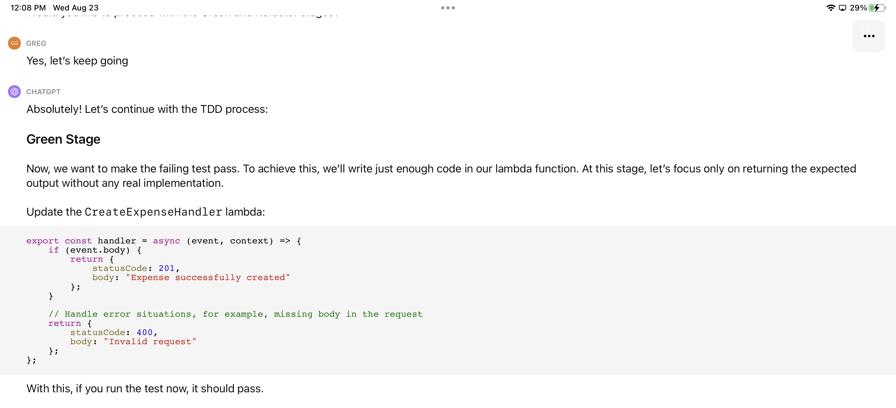

# ChatGPT SDLC

How to bring AI technology to every step of the Software Development LifeCycle (SDLC)

Presented by: Greg Gzik
https://www.linkedin.com/in/gregory-gzik/

(Source: https://www.zeta-alpha.com/post/growth-of-ai-research-in-2020-steady-on-the-exponential-path-in-times-of-crisis)

## The Software Development LifeCycle ("SDLC")

There are many SDLCs out there, I'm sure your company has its own. But here's a standard template we'll follow for this presentation, with a few modifications to tailor the process to us developers.

### Our Example Problem

Taxes are complicated - doubly so for our right-brained musicians!

Source: https://www.canada.ca/en/revenue-agency/services/tax/individuals/topics/about-your-tax-return/tax-return/completing-a-tax-return/deductions-credits-expenses/line-22900-other-employment-expenses/employed-artists.html

## Discovery

There are many ways to tackle discovery as a business that involve many different kinds of stakeholders.
But at the end of the day, the challenge is the same: 
> In the simplest possible terms, what is the problem we are trying to solve?

Process-wise, what framework(s) can we use tackle this challenge? Here's one: The 5 Whys Analysis.

Here, we may ask our users a list of questions about their experience, and from those list of questions drill down using a 5 Whys technique that help us at the root problem.

So what questions should we start asking? Let's see what ChatGPT says...

These 10 questions are pretty good start. 

Let's pop on a quick call with the musician and get some answers. I'm going to use a video-calling software that does auto-transcriptions so I can copy & paste our discussion back into ChatGPT. This transcript record is pretty ugly, so I've asked ChatGPT to clean it up a bit (I've also edited some of the responses to protect the identity of the musician). 

Already, you can see some useful insights in these questions:

The biggest takeaways are:
- Taxes are confusing, but he's using WealthSimple Tax to sort out a lot of the details for him
- Calculating out-of-town transportation expenses are still a pain point
- Right now he keeps his receipts in a shoebox and uploads them to the cloud, then reviews them every so often.

We've already narrowed down the problem: "Canada's tax system is confusing for musicians -> Tracking the out-of-town transportation costs are painful"

Let's continue with the 5 whys on this problem. Again, I've ask ChatGPT to format the transcript and clean up the wording a bit:

So what we can see is that his gigs are stored in one system (his calendar) and the receipts are stored in a separate system (photos in the cloud), or not at all.

This leaves us with one final problem statement:

There are many other steps to the discovery process, like finding alternative solutions in the market, creating a business case, etc. But so far, by combining the 5 Whys framework with ChatGPT, we have:
1. Created a standard template of questions to ask our users during the discovery process.
2. Streamlined the analysis of our discussions.
3. Worked together - User + Us + AI - to clearly define the problem.

Is all of this possible without ChatGPT? Of course! But using ChatGPT helped us turn one 10 minute phone call into soemthing immediately actionable!

## Design

Let's start designing what a potential solution might look like for our musician.
As usual, we will need a framework for our thinking, and user-centred design fits that need well:

What is User-Centred Design? Well, I'm certainly not a desiger, so let's ask ChatGPT:

UCD by itself would be a big talk, a talk that I am certainly not qualified to give.

Let's instead focus on two core components of UCD:
1. Defining Personas
2. Defining Use Cases

I bet ChatGPT knows more about this!

Let's see, with minimal prompting, how ChatGPT does in generating these personas. Note that it hullicinates some details about the personas (like the name "John"), but still gets the important details around goals and pain points correct:

Let's continue on with the process and see if ChatGPT can use these prompts and use-cases to design solutions:

That's pretty damn good! As a developer, if a designer gave these designs to me, I would probably say:
- Use case #1 is good, but OCR is probably out of scope for V1. A simple form ought to do.
- It would be really cool if there was an API available to get the gas prices for that day, it would make our job a lot easier.
- For use case #2, perhaps we should assume these reminders are email reminders, since that will scale best for both mobile and web platforms.

I'll let GPT know and move on.

Let's see if we can turn this into some detail that allows us to create UI/UX mocks:

We could keep going here, and have GPT write code to interface with tools like Figma to create these designs, but I suspect our humans will be better at doing these visual tasks for the time being. At least, as a developer, I can see the main pages we need to implement to get a working soltuion. Plus, I'm itching to dive straight into the architecture anyway!

## Architecture

Typically, organizations will have a preferred technology stack that will help frame their architectural considerations. Today, we are going to assume our organization:
1. Uses AWS as a single-cloud platform
2. Is serverless-first in design principle
3. Focusses primarily on web development

Now, there are many frameworks for thinking about architecture: service-oriented architectures, event-driven architectures, MVC, etc.
I think ultimately the framework you choose to think about architecture will depend on your organization.

But, for the purposes of ChatGPT SDLC, I will recommend one framework in particular: contract-first development.

What is contract-first development? Let's let GPT explain...

For the purposes of ChatGPT SDLC, contract-driven development focusses the conversation on the connecting the architecture with the **user requirements**, allowing developers to fill in the architectural details but relying on the computer (GPT) to ensure nothing is missed along the way.

Let's see this in action.

Already, GPT gives us a good base to go off of. For example, the fact that user management was necessary might have been a detail that would have been missed on the first architecture pass through.

Now, we will want to get more specific and define each of these requests more specifically. Doing so for each endpoint could get time-consuming, so let's ask GPT to only focus on the "Add New Expense" functionality for now:

This is pretty good, but we do want to ensure the gas price functionality is available to auto-fill this expense on the page. Plus, I'm not a big fan of the expense type field when we're only implementing transportation expenses. Let's see how GPT adapts to this feedback:

Not bad! Not a big fan of `/current`, but that's an easy modification we can make.

Alright, let's see how good GPT is at brainstorm the backend architecture for these endpoints:

Again, not bad! My preference here would have been Step Functions over Lambda, and to use a better Single Table Design pattern for the Dynamo schema, but overall we can get a pretty clear picture of the architcture here:

We can continue this process for the other endpoints - but let's move on

## Pause - What is our Mindset here?

The key is to be process-first and to treat humans + AI as part of the process.

## Project Breakdown

This one isn't a going to be shocker to anyone, but of course ChatGPT can write your user stories!

If you aren't already doing this, I highly encourage you to play around. Some company's use the standard Scrum processes, otherwise modify the process for their own needs. As usual, prompt ChatGPT with the specifics of our process and work from there.

You can take this further by integrating with Jira (e.g. via an API, code that ChatGPT can write for you).

## Development

Let's get into the nitty gritty: development time!

What framework can we use to guide our development? I think there is no better code-writing process than Test-Driven Development:

TDD has three main stages:
1. Red: Write tests until the tests fail
2. Green: Write the implementation until the tests pass
3. Refactor: Review the code and interfaces to optimize for readability and maintainability

First, we will set uo our initial files in the src folder. We will use NodeJS to implement the code for our CreateExpense API in this example.

Now, let's prompt ChatGPT with TDD, and our code setup:

Let's watch how ChatGPT manages between switching back and forth between Red and Green stages. The "human" intervention will come in in the refactor stage to get Red + Green to work.

## Testing

By far, the most important framework when performing software testing to have in our minds is the Test Pyramid:

The test pyramid helps us visualize the amount, speed, and cost of our software tests, ensuring more of our test cases occur in more stable areas with faster feedback loops:

How can ChatGPT help us here? Well, not only does it understand the test pyramid, but it can help us brainstorm test cases and place them appropriately on the pyramid:

With this in mind, we can use the same approach during development to write the test code for the unit, integration, and E2E levels.

Also, don't forget, ChatGPT is excellent at writing test data!

## Deployment

TODO

## Maintenance

TODO

## Finale - The ChatGPT SDLC

Presented by Greg Gzik

https://www.linkedin.com/in/gregory-gzik/